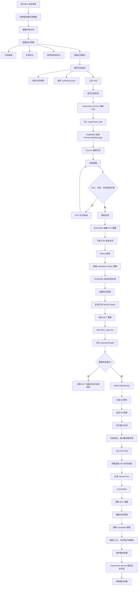
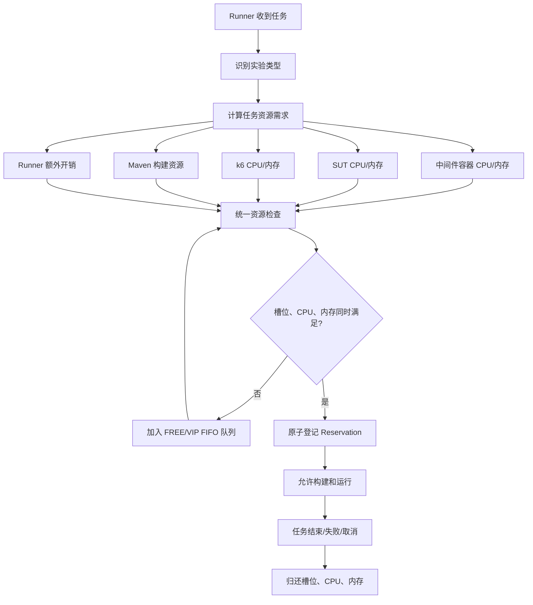
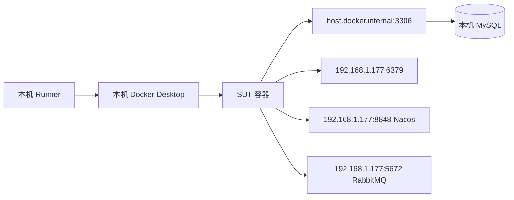
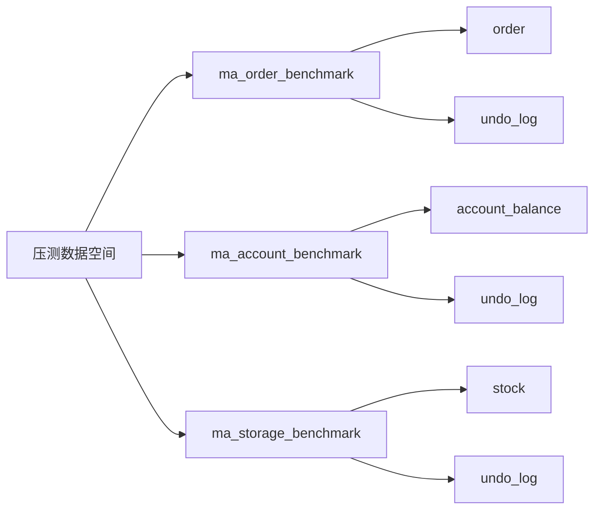
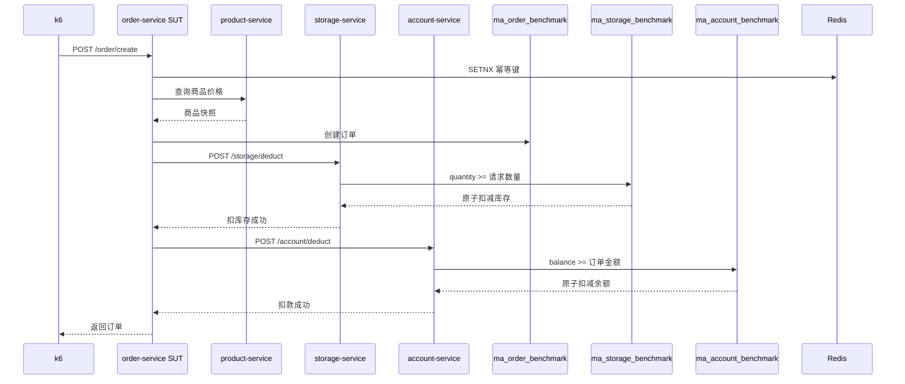
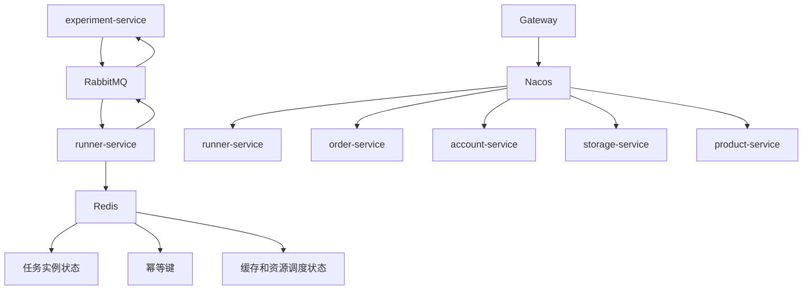
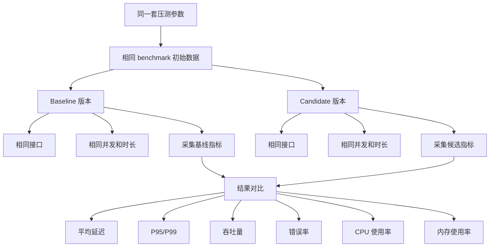

# Middleware Arena 压测全流程图

## 一、整体压测流程



## 二、资源分配



当前默认平台容量：

```text
最大并发：3 个任务
最大 CPU：4 核
系统保留：0.5 核
可调度 CPU：3.5 核
最大内存：8192 MB
系统保留：1024 MB
可调度内存：7168 MB
```

Redis 实验当前预留约 `2 核 CPU + 2048 MB 内存`。

## 三、共享基础设施



当前 SUT 会使用：

```text
MySQL：本机 benchmark 数据库
Redis：192.168.1.177 上已有 Redis
Nacos：192.168.1.177:8848
RabbitMQ：192.168.1.177:5672
SUT 端口：8080
```

## 四、压测数据库



当前已准备：

```text
用户 ID：4
账户余额：100000000 分
商品 ID：1
商品库存：1000000
```

正式库不会被压测任务直接使用：

```text
正式库：ma_order / ma_account / ma_storage
压测库：ma_order_benchmark / ma_account_benchmark / ma_storage_benchmark
```

## 五、创建订单、扣库存、扣余额



库存不足或余额不足时，由 Seata AT 回滚订单、库存和账户变更。

## 六、Nacos、RabbitMQ、Redis 职责



```text
RabbitMQ：任务投递、进度回传、最终结果回传
Nacos：服务注册与服务发现
Redis：缓存、幂等键、任务状态、资源状态
MySQL：实验任务、订单、余额、库存持久化
Docker：SUT 和 k6 容器运行环境
```

## 七、基线版本和候选版本



核心原则：Baseline 和 Candidate 必须使用相同的接口、请求参数、并发梯度以及初始账户、库存和数据库状态。
