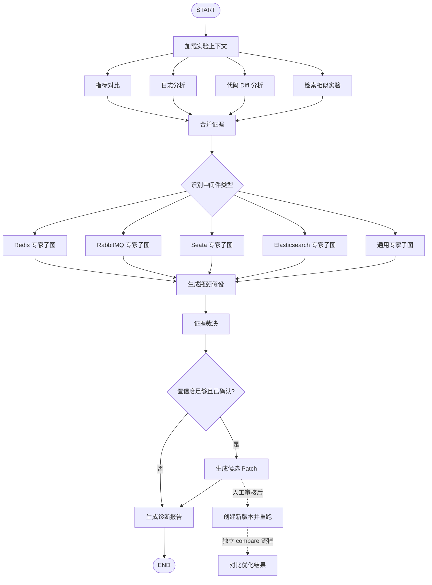

# Middleware Arena — AI Agent

Python FastAPI + LangGraph 实验分析服务。

Agent 的定位不是通用聊天机器人，而是 **Middleware Arena 的实验诊断引擎**：接收一次中间件性能实验的代码 Diff、运行配置、压测指标和日志，自动完成指标对比、异常证据提取、代码变更分析、历史实验检索、瓶颈判断和实验报告生成。

## 1. Agent 在系统中的位置

```text
用户修改实验代码 / 配置
        ↓
experiment-service 创建实验任务
        ↓
RabbitMQ 排队
        ↓
runner-service
        ↓
构建 → 起容器 → k6 压测 → 采集指标 / 日志
        ↓
POST /analyze
        ↓
middleware-arena-agent
        ↓
瓶颈诊断 + 建议 + 实验报告
        ↓
experiment-service 保存结果 / 前端展示
```

当前 Agent 同时保留两个独立能力：

- `POST /resource/advice`：**实验前资源规划**，根据规则预算、历史资源使用和 LLM 建议计算 CPU / 内存预算。
- `POST /analyze`：**实验后性能诊断**，这是当前 Agent 模块的核心开发目标。

两者不要放进同一个 LangGraph：资源规划是一次独立计算，实验分析才需要多节点状态流转。

---

## 2. 当前目录

```text
app/
├── main.py                  # FastAPI 入口；当前已挂 /health、/resource/advice；TODO 挂 /analyze
├── state.py                 # LangGraph AnalysisState；TODO 补全分析中间状态
├── resource_advice.py       # 实验前资源建议，当前可独立工作
├── nodes/
│   └── analysis_nodes.py    # TODO：7 步实验分析节点
└── services/
    └── llm.py               # OpenAI 兼容 LLM 接入；当前已用于资源建议

tests/
└── test_resource_advice.py  # 资源建议单测
```

后续建议演进为：

```text
app/
├── api/
│   └── analyze.py
├── graph/
│   ├── analysis_graph.py
│   ├── evidence_graph.py
│   └── report_graph.py
├── nodes/
│   ├── read_result.py
│   ├── compare_metrics.py
│   ├── retrieve_similar.py
│   ├── analyze_logs.py
│   ├── analyze_diff.py
│   ├── judge_bottleneck.py
│   └── generate_report.py
├── models/
│   ├── request.py
│   └── response.py
└── services/
    ├── llm.py
    ├── elasticsearch.py
    └── langfuse.py
```

---

## 3. `/analyze` API 目标契约

### 请求

```http
POST /analyze
Content-Type: application/json
```

```json
{
  "experiment_id": 10001,
  "experiment_type": "REDIS",
  "code_diff": "- old code\n+ new code",
  "config": {
    "vus": 100,
    "duration": "30s"
  },
  "baseline_metrics": {
    "qps": 1200,
    "p95_ms": 80,
    "error_rate": 0.01,
    "cpu_percent": 65,
    "memory_mb": 512
  },
  "metrics": {
    "qps": 1800,
    "p95_ms": 45,
    "error_rate": 0.005,
    "cpu_percent": 82,
    "memory_mb": 570
  },
  "logs": [
    "WARN redis connection pool waiting..."
  ]
}
```

### 响应

```json
{
  "experiment_id": 10001,
  "bottleneck": "CPU",
  "confidence": 0.89,
  "evidence": [
    "QPS 相比基线提升 50%",
    "P95 从 80ms 降低至 45ms",
    "CPU 从 65% 上升至 82%"
  ],
  "suggestions": [
    "继续提高并发前先确认 CPU 饱和点",
    "检查 Redis 连接池是否成为下一阶段瓶颈"
  ],
  "report": "Markdown 格式实验分析报告"
}
```

### 输入约束

- `metrics`：本次实验指标，至少允许携带 QPS、P95、错误率、CPU、内存中的一部分。
- `baseline_metrics`：修改前或对照组指标；没有基线时允许为空，但必须在报告中降低置信度。
- `code_diff`：本次实验相对基线的 Git Diff；允许为空。
- `logs`：Runner 截取的关键日志，禁止把无限长度原始日志直接发送给 LLM。
- `experiment_type`：Redis / RabbitMQ / Seata / Elasticsearch 等实验类型，用于选择不同诊断规则和 Prompt。

---

## 4. LangGraph 主流程

当前实现主链：



`Patch` 只生成可审核候选内容。应用 Patch、创建版本和重跑属于写操作，必须经过
人工确认后由 Java 服务执行，不在一次 `/agent/analyze` 调用中自动发生。

### 主要节点职责

| 节点 | 是否调用 LLM | 输入 | 输出 | 完成标准 |
|---|---:|---|---|---|
| `load_context` | 否 | taskId | 标准化实验上下文 | 只从 Java 内部接口读取可信事实 |
| `analyze_metrics` | 否 | metrics + baseline | metric findings + evidence | 代码计算变化，不让 LLM 做算术 |
| `retrieve_similar` | 否 | experiment_type + config + metrics | similar_experiments | 从 Elasticsearch 查同类历史实验；ES 不可用时允许降级为空列表 |
| `analyze_logs` | 是 | 精简后的日志 | log_analysis + evidence | 提取超时、OOM、连接池耗尽、锁等待、MQ 堆积等异常证据 |
| `analyze_code` | 否 | code diff + rule | code findings + evidence | 规则只标风险，不把代码模式直接判成已发生故障 |
| `middleware_router` | 否 | middleware type | expert route | 未知类型进入通用专家，不中断流程 |
| `generate_hypothesis` | 是 | 专家输出 + evidence | ranked hypotheses | 假设必须引用有效 evidenceId |
| `judge_bottleneck` | 是 | 所有分析证据 | bottleneck + confidence + suggestions | 输出结构化诊断；结论必须引用 evidence |
| `confidence_router` | 否 | judgement + confidence | patch/report route | 只有 CONFIRMED 且达到阈值才生成 Patch |
| `generate_patch` | 是 | 已确认瓶颈 + editable files | candidate patches | 不写文件；过滤越权路径和无证据 Patch |
| `generate_report` | 是 | 完整 AnalysisState | report | 输出 Markdown 报告，包含指标变化、证据、瓶颈、建议和置信度 |

### 节点设计原则

1. **确定性计算优先代码实现**：指标变化、阈值、排序、P95 等由 Python 完成。
2. **LLM 只做语义分析和综合判断**：日志解释、Diff 影响、瓶颈归因、报告生成。
3. 所有关键 LLM 节点使用 `with_structured_output(...)`，不要靠正则解析自然语言 JSON。
4. Agent 结论必须有 `evidence`，不能只有一句“Redis 是瓶颈”。
5. LLM、ES、Langfuse 失败不能导致整个实验任务丢失；能降级的节点必须降级。

---

## 5. `AnalysisState` 目标字段

```python
class AnalysisState(TypedDict, total=False):
    # 输入
    experiment_id: int
    experiment_type: str
    code_diff: str
    config: dict[str, Any]
    metrics: dict[str, Any]
    baseline_metrics: dict[str, Any]
    logs: list[str]

    # 中间结果
    metric_analysis: dict[str, Any]
    log_analysis: dict[str, Any]
    diff_analysis: dict[str, Any]
    similar_experiments: list[dict[str, Any]]

    # 最终诊断
    bottleneck: str
    confidence: float
    evidence: list[str]
    suggestions: list[str]

    # 最终报告
    report: str
```

如果后续并行节点都会追加 `evidence`，需要为该字段配置 reducer，避免多个节点写入时互相覆盖。

---

## 6. LLM 接入

当前使用 `langchain-openai` 的 OpenAI 兼容接口，因此可以切换 DeepSeek 或其他兼容模型。

`.env` 示例：

```env
OPENAI_API_BASE=https://api.deepseek.com
OPENAI_API_KEY=your_key
OPENAI_MODEL=deepseek-v4-flash
```

要求：

- `temperature=0`，优先保证诊断稳定性。
- 诊断输出使用 Pydantic Schema。
- API Key 未配置、超时或模型不可用时，允许按节点配置 fallback。
- 不在 Prompt 中直接拼接无限长度日志；先做截断、采样和错误聚合。

现有 `/resource/advice` 已经实现“LLM 失败 → 规则结果兜底”，实验分析模块沿用同样的工程思路。

---

## 7. 资源建议接口（已存在）

`POST /resource/advice` 接收规则预算、同类实验历史指标和运行参数：

```json
{
  "experiment_type": "REDIS",
  "run_params": {"vus": 20, "duration": "30s"},
  "rule_budget": {"cpus": 2.0, "memory_mb": 2048},
  "max_budget": {"cpus": 3.0, "memory_mb": 4096},
  "history": [
    {"cpu_cores": 1.6, "memory_mb": 1800},
    {"cpu_cores": 1.8, "memory_mb": 1900}
  ]
}
```

计算规则：

```text
final = min(
    max_budget,
    max(规则预算, 历史 P95 × safety_factor, LLM 建议)
)
```

未配置或无法访问 LLM 时自动退回规则与历史计算，并通过 `llm_used=false` 标识。

---

## 8. 当前实现与后续项

### P0 — 先跑通完整 Agent 链路

- [x] **定义 `/analyze` Request / Response Pydantic 模型**
  - 明确必填字段、默认值和长度限制。
  - 对 `confidence` 限制在 `0~1`。
  - 限制日志条数、单条长度和 Diff 最大长度。
- [x] **补全 `AnalysisState`**
  - 加入 `experiment_type`、`logs`、`metric_analysis`、`log_analysis`、`diff_analysis`、`similar_experiments`。
  - 为并行追加字段预留 reducer。
- [x] **实现 `load_context`**
  - 做字段标准化和基础校验。
  - 不访问 LLM。
- [x] **实现 `analyze_metrics`**
  - 计算 QPS、P95、错误率、CPU、内存的绝对值和百分比变化。
  - 处理基线为 0、字段缺失等边界情况。
- [x] **实现 `analyze_logs`**
  - 使用确定性规则提取异常类型、关键证据和严重程度。
  - 日志为空时直接返回空分析。
- [x] **实现 `analyze_code`**
  - 使用结构化输出判断代码修改可能影响的资源、并发、锁、连接池、序列化等维度。
  - Diff 为空时跳过。
- [x] **实现 `judge_bottleneck`**
  - 综合指标、日志、Diff 证据输出 `bottleneck/confidence/evidence/suggestions`。
  - 不允许输出没有证据支持的高置信度结论。
- [x] **实现 `generate_report`**
  - Markdown 报告至少包含：实验摘要、指标对比、主要证据、瓶颈判断、优化建议、置信度。
- [x] **创建 LangGraph `analysis_graph`**
  - 串起 P0 节点。
  - 先使用单主图跑通，不急于拆 SubGraph。
- [x] **挂载 `POST /agent/analyze`**
  - 调用 graph，并把最终状态转换为 Response。
- [x] **增加 Agent 单元测试**
  - 正常指标、无基线、空日志、空 Diff、LLM 失败至少各覆盖一个用例。

### P1 — 增强诊断能力

- [x] **相似实验检索 `retrieve_similar`**
  - 通过 experiment-service 根据中间件类型、场景、配置和指标距离查询历史实验。
  - 返回 Top-K 历史实验和最终诊断结果。
  - ES 不可用时返回空列表，不阻断主流程。
- [x] **并行证据节点与中间件 SubGraph**
  - 指标、日志、代码 Diff、相似实验并行分析并由 reducer 合并。
  - 支持无依赖节点并发执行。
- [x] **按中间件类型拆诊断策略**
  - Redis：大 Key、热 Key、连接池、缓存穿透/击穿、慢命令。
  - RabbitMQ：积压、消费者吞吐、prefetch、ack、重试/死信。
  - Seata：全局锁、分支事务、回滚、TC/TM/RM 调用延迟。
  - Elasticsearch：慢查询、mapping、分片、refresh、bulk、深分页。
- [x] **规则诊断 + LLM 诊断融合**
  - 明确确定性规则优先级。
  - LLM 负责补充解释，而不是覆盖硬指标事实。

### P2 — 工程化与可观测

- [x] **Langfuse Trace 与 Prompt Management**
  - 一次实验分析对应一个 Trace。
  - 每个 LangGraph 节点记录输入摘要、输出、耗时、Token、异常。
  - `scripts/sync_langfuse_prompts.py` 初始化 9 个 production Prompt。
- [ ] **Langfuse Eval**
  - 建立固定测试集。
  - 评估瓶颈分类正确率、证据引用质量、建议可执行性和结构化输出成功率。
- [ ] **Retry / Timeout / Fallback**
  - LLM 超时与 429 使用有限次数指数退避。
  - 结构化输出失败允许一次修复或 fallback。
  - 不允许无限重试。
- [ ] **Checkpoint**
  - 为耗时分析预留 LangGraph Checkpointer。
  - 使用 experiment_id / analysis_id 作为 thread 标识，实现失败后断点恢复。
- [ ] **并发限制**
  - 限制单实例同时运行的分析任务和 LLM Tool/Node 调用数量。
  - 防止批量实验同时完成时把模型 API 打满。
- [ ] **幂等**
  - 同一 experiment_id 重复提交时可复用成功结果或安全重跑，不重复写入多份最终报告。

---

## 9. 推荐开发顺序

```text
1. AnalysisState
2. /analyze Request / Response
3. compare_metrics
4. analyze_logs
5. analyze_diff
6. judge_bottleneck
7. generate_report
8. analysis_graph
9. FastAPI /analyze
10. tests
11. Elasticsearch retrieve_similar
12. SubGraph + 并行节点
13. Langfuse Trace / Eval
14. Retry / Checkpoint / 并发限制
```

先保证 HTTP → LangGraph → 结构化诊断 → 报告完整跑通，再接外部依赖。

---

## 10. 启动

```powershell
python -m venv .venv
.\.venv\Scripts\Activate.ps1
pip install -r requirements.txt
Copy-Item .env.example .env
.\.venv\Scripts\python.exe scripts\sync_langfuse_prompts.py
uvicorn app.main:app --reload --port 9500
```

健康检查：`GET http://localhost:9500/health`

资源建议：`POST http://localhost:9500/agent/resource/advice`

实验分析：`POST http://localhost:9500/agent/analyze`
