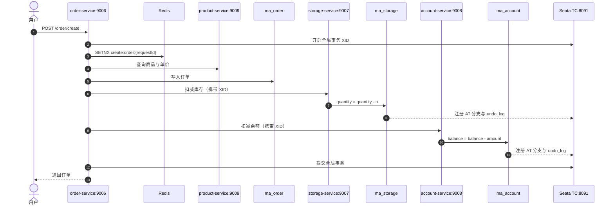
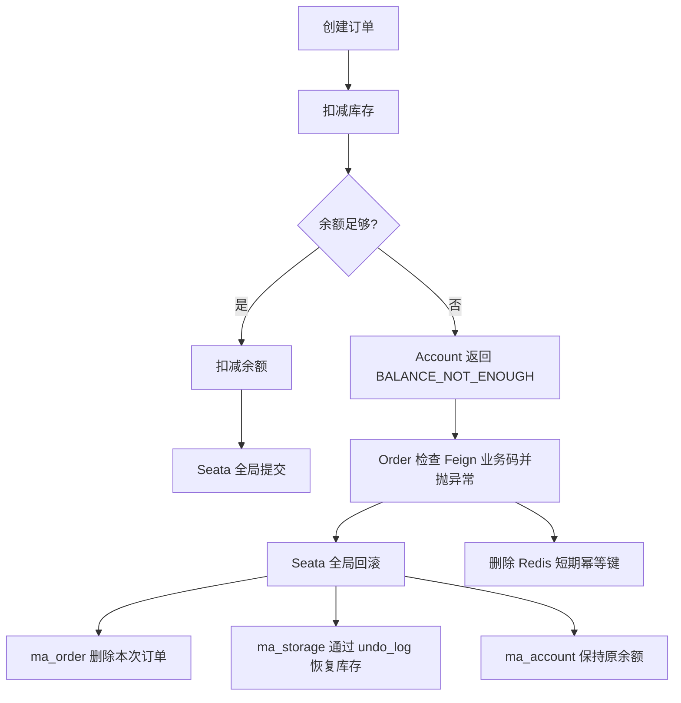

# middleware-arena-order

订单服务（端口 `9006`），负责创建订单，并通过 Seata AT 协调库存服务和账户服务。

## 下单链路

## 失败回滚

## 数据与配置

- `ma_order`、`ma_storage`、`ma_account` 三个数据库都必须有 `undo_log`。
- 首次建库执行各服务的 `sql/init.sql`；已有订单库执行 `sql/upgrade_seata_order.sql`。
- 三个服务使用同一个 `seata.tx-service-group=middleware_arena_tx_group`。
- `request_id` 同时受 Redis `SETNX` 和数据库唯一键保护。

## 验收条件

- 正常下单：订单新增，库存和余额按订单数量、金额扣减。
- 库存不足：三个业务库都不发生变化。
- 余额不足：已写订单和已扣库存均由 Seata 回滚。
- 同一用户重复提交相同 `requestId`：返回原订单，不重复扣减。
