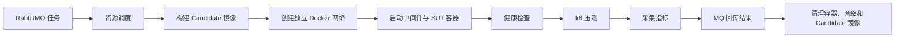

# middleware-arena-runner

Runner 服务（端口 `9004`）消费实验任务，并按以下流水线执行：

任务使用手动 ACK、重试和 DLQ；阶段状态通过 `experiment.task.status.exchange` 回传。每个任务有独立网络、CPU/内存硬限制和可取消的本地 Future，清理逻辑在成功、失败和取消时都会执行。

真实执行依赖 Docker daemon、模板工作目录、离线 Maven/JDK 和 k6 镜像。Windows 本机需启动 Docker Desktop，并通过 `DOCKER_HOST` 指向可用 daemon。
